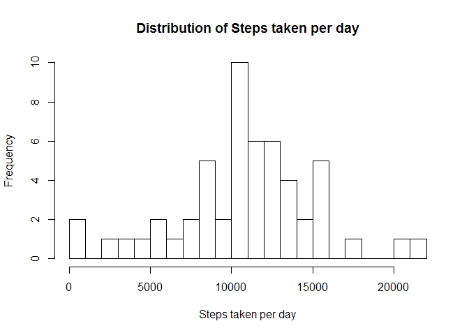
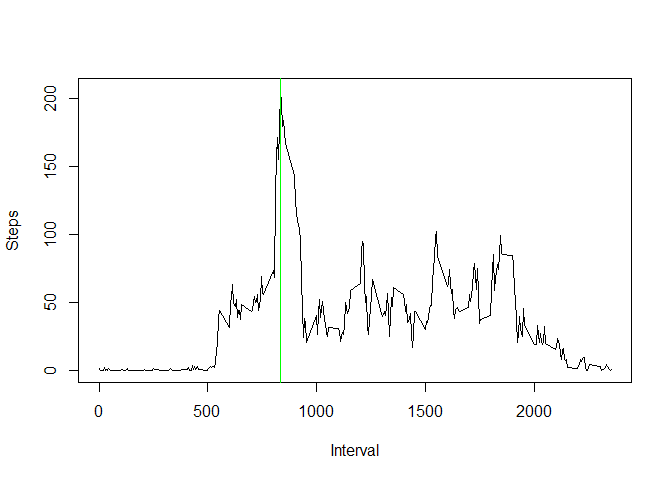

# Reproducible Research: Peer Assessment 1
Mark Gao  
Monday, April 18, 2015  

## Loading and preprocessing the data

```r
library(dplyr)
sdata <- read.csv('activity.csv')  ##original source data
sdata$date <- as.Date(sdata$date, format = "%Y-%m-%d")
pdata <-as.data.frame(sdata[is.na(sdata[,1])==FALSE,])  ## processed data, filter out NA rows
```

## What is mean total number of steps taken per day?

```r
total_per_day <-pdata %>% group_by(date) %>% summarise(total = sum(steps))
hist(total_per_day$total, breaks = max(total_per_day$total)/1200, main = "Distribution of Steps taken per day", xlab = "Steps taken per day")
```

 

```r
mean1 <- as.integer(mean(total_per_day$total))
median1 <- median(total_per_day$total)
```
mean of the total number of steps taken per day: 10766; 

median of the total number of steps taken per day: 10765

## What is the average daily activity pattern?

```r
total_per_int <-pdata %>% group_by(interval) %>% summarise(int_total = mean(steps)) 
max_steps <- max(total_per_int$int_total)
max_interval <-  total_per_int %>% filter(int_total==max_steps)

plot(total_per_int$interval, total_per_int$int_total, type="l", xlab="Interval", ylab= "Steps")
abline(v = max_interval$interval, col="green")
```

 

The 5-minute interval=835 contains the maximum number of steps 206.1698113
 

## Imputing missing values

the total number of missing values in the dataset (i.e. the total number of rows with NAs)

```r
count(sdata) - count(pdata)
```

```
##      n
## 1 2304
```
Fill in all of the missing values in the dataset by 0 as a strategy of simplifying imputing missing values (may not the best. We will analysis the difference next)


```r
sdata$steps[is.na(sdata$steps)]<-0
```

Then calculate and report the mean and median total number of steps taken per day


```r
total_per_day2 <-sdata %>% group_by(date) %>% summarise(total = sum(steps))
hist(total_per_day2$total, breaks = max(total_per_day2$total)/1200, main = "Distribution of Steps taken per day", xlab = "Steps taken per day")
```

 

```r
mean2 <- as.integer(mean(total_per_day2$total))
median2 <- as.integer(median(total_per_day2$total))
```
mean of the total number of steps taken per day: 9354; 

median of the total number of steps taken per day: 10395

We can see above imputing missing data stragety makes mean and median of the total number of steps taken per day lower. Mean value drops more than median value does. This is another evidance that median value is impacted less by missing values than average value (mean) does.

## Are there differences in activity patterns between weekdays and weekends?

First, add two new columns, weekday and weekendFlag

```r
data_wks <- cbind(sdata,weekday=weekdays(sdata$date), weekendFlag=weekdays(sdata$date)==c("Sunday","Saturday"))
head(data_wks)
```

```
##   steps       date interval weekday weekendFlag
## 1     0 2012-10-01        0  Monday       FALSE
## 2     0 2012-10-01        5  Monday       FALSE
## 3     0 2012-10-01       10  Monday       FALSE
## 4     0 2012-10-01       15  Monday       FALSE
## 5     0 2012-10-01       20  Monday       FALSE
## 6     0 2012-10-01       25  Monday       FALSE
```
